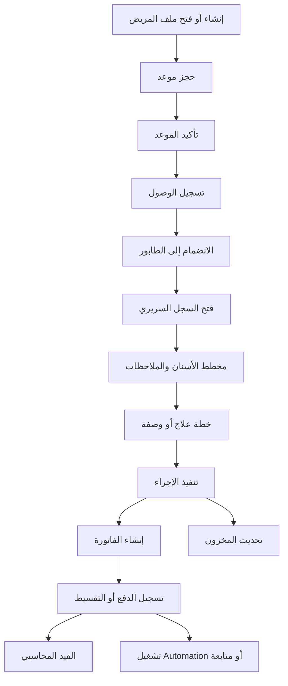
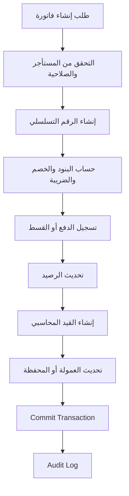
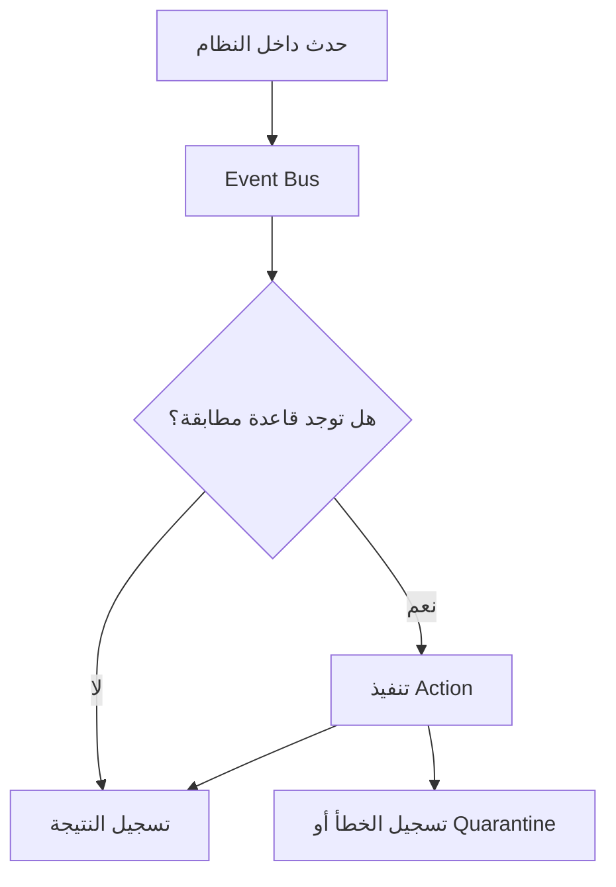
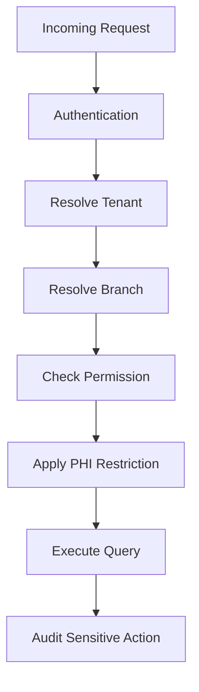

# Dental OS

## Product Requirements Document — Foundation Baseline

**الإصدار:** 5.0 — Foundation Baseline  
**الحالة:** مرجع التنفيذ الأساسي  
**آخر تحديث:** سبتمبر 2026  
**نطاق الإصدار:** الميزات الـ32 المكتملة في الكود  
**المعمارية الأساسية:** Modular Monolith مبني على MERN  
**قاعدة الوثيقة:** أي ميزة غير مذكورة ضمن الـFoundation أو ضمن خارطة الطريق يجب ألا تُعتبر جزءًا من المنتج الحالي.

---

# 1. الملخص التنفيذي

Dental OS هو نظام تشغيل متكامل لإدارة عيادات الأسنان، يغطي:

- المصادقة والصلاحيات.
- عزل المستأجرين والفروع.
- ملفات المرضى والسجل السريري.
- مخطط الأسنان.
- المواعيد والطوابير.
- الفوترة والتحصيل والأقساط.
- المحاسبة والمخزون.
- المحادثة وWhatsApp.
- إدارة المستأجرين والخطط والاشتراكات.
- السجلات التدقيقية والنسخ الاحتياطية والمراقبة.
- الأحداث والأتمتة وقوالب التشغيل.
- اختبارات الوحدة والعقود والأمان وعزل المستأجرين.

الـFoundation الحالي ليس مجرد نموذج أولي؛ بل هو نواة تشغيلية متكاملة يمكن البناء فوقها لاحقًا لإضافة:

- بوابة المريض.
- بوابات الدفع الخارجية.
- FHIR.
- الذكاء الاصطناعي.
- التأمين.
- التطبيقات المحمولة.
- التحليلات المتقدمة.
- التكاملات الخارجية.

هذه الميزات المستقبلية لا تُعتبر جزءًا من المنتج الحالي ولا يجب استخدامها في تعريف الـMVP الحالي.

---

# 2. أهداف المنتج

## 2.1 الهدف الأساسي

تمكين العيادة من إدارة دورة المريض الأساسية من داخل نظام واحد:

> إنشاء المريض → حجز الموعد → الحضور والطابور → الفحص والعلاج → الفاتورة → التحصيل → القيد المالي → المخزون → المتابعة والأتمتة.

## 2.2 أهداف الـFoundation

- منع الوصول غير المصرح به إلى بيانات المرضى.
- ضمان العزل الكامل بين المستأجرين والفروع.
- دعم التشغيل اليومي للعيادة.
- ضمان الاتساق المالي باستخدام المعاملات الذرية.
- توفير سجل تدقيق غير قابل للتلاعب.
- توفير طبقة أحداث وأتمتة قابلة للتوسع.
- توفير أساس آمن لإضافة الميزات المستقبلية.

## 2.3 ما لا يهدف إليه الإصدار الحالي

لا يهدف هذا الإصدار إلى تنفيذ:

- Patient Portal أو تطبيق مريض مستقل.
- بوابات دفع خارجية.
- Stripe Billing.
- FHIR Export.
- مطالبات التأمين.
- AI Prediction أو Copilot.
- Telehealth.
- Marketplace.
- Loyalty أو Referral Platform.
- Data Lake أو Benchmarking بين العيادات.

---

# 3. نطاق المنتج الحالي

## 3.1 مصفوفة الميزات المكتملة

| # | الميزة | المجال | الحالة |
|---|---|---|---|
| 1 | JWT Access/Refresh + bcrypt + CSRF + Rate Limiting | المصادقة | مكتملة |
| 2 | TOTP 2FA إلزامي للمنصة | الأمان | مكتملة |
| 3 | RBAC: 20 Module × CRUD + 8 أدوار + أدوار ديناميكية | الصلاحيات | مكتملة |
| 4 | Tenant Router + PHI Restrict Middleware | Multi-Tenancy | مكتملة |
| 5 | ملف مريض موحد + Patient ID تسلسلي + PHI | المرضى | مكتملة |
| 6 | عزل الفرع والمستأجر + Patient Limit حسب الخطة | المرضى والخطط | مكتملة |
| 7 | مخطط أسنان تفاعلي ثنائي الفك | EMR | مكتملة |
| 8 | Clinical Notes + Treatment Plans + Prescriptions | EMR | مكتملة |
| 9 | Attachments + Timeline + Before/After Photos | EMR | مكتملة |
| 10 | Calendar: يومي/أسبوعي/شهري + Chair Booking | المواعيد | مكتملة |
| 11 | Live Queue باستخدام Socket.io | المواعيد | مكتملة |
| 12 | Time-Based Statuses + Doctor Availability | المواعيد | مكتملة |
| 13 | Invoice Atomic Sequence + Discounts + Taxes | الفوترة | مكتملة |
| 14 | طرق دفع متعددة + دفعات جزئية + Refunds | التحصيل | مكتملة |
| 15 | Doctor Commissions + Aging | المالية | مكتملة |
| 16 | Installments + Wallet Credit/Debit + Transfers | الأقساط | مكتملة |
| 17 | Cron Alerts لمواعيد الأقساط | الأتمتة المالية | مكتملة |
| 18 | Chart of Accounts + Double-Entry Journal | المحاسبة | مكتملة |
| 19 | Daily Close + Expenses + Owner Drawings | المحاسبة | مكتملة |
| 20 | Inventory + Reorder Point + Supply/Consumption/Depreciation | المخزون | مكتملة |
| 21 | خصم/صرف المخزون تلقائيًا وربطه بالإجراءات | المخزون | مكتملة |
| 22 | DM + Channels + Read Receipts + Audio Notifications | التواصل | مكتملة |
| 23 | WhatsApp عبر whatsapp-web.js مع Switching Architecture | التكاملات | مكتملة |
| 24 | Tenant Management + Plans/Subscriptions | SaaS | مكتملة |
| 25 | Suspension Cron + Analytics | SaaS | مكتملة |
| 26 | Immutable Audit Logs | الحوكمة | مكتملة |
| 27 | Encrypted Backups + Health/Performance Monitoring | التشغيل | مكتملة |
| 28 | Feature Flags + Error Logs + Quarantine | التشغيل | مكتملة |
| 29 | Impersonation + Platform 2FA | إدارة المنصة | مكتملة |
| 30 | In-Memory Event Bus + Automation Engine | الأتمتة | مكتملة |
| 31 | Automation Templates: No-show, Survey, Reorder, Recall | الأتمتة | مكتملة |
| 32 | Vitest Unit/Contract/Security + Tenant Isolation CI Tests | الجودة | مكتملة |

> **ملاحظة:** كلمة «مكتملة» تعني أن الميزة موجودة ضمن نطاق الكود الحالي، مع استمرار الحاجة إلى التحقق من التغطية، الأداء، وتجهيز الإنتاج.

---

# 4. المستخدمون والأدوار

## 4.1 أنواع المستخدمين

1. **Platform Super Admin**
   - إدارة المنصة والمستأجرين والخطط.
   - Impersonation وفق ضوابط المنصة.
   - الاطلاع على Analytics وHealth Monitoring.
   - يتطلب 2FA.

2. **Platform Admin**
   - إدارة تشغيلية محدودة للمنصة.
   - يتطلب 2FA حسب سياسة المنصة.

3. **Clinic Manager**
   - إدارة العيادة والفروع والموظفين والتقارير.

4. **Doctor**
   - السجل السريري ومخطط الأسنان وخطط العلاج والوصفات.

5. **Receptionist**
   - المرضى والمواعيد والطابور والتحصيل الأساسي.

6. **Accountant**
   - الفواتير والدفعات والأقساط والمحاسبة والإقفال.

7. **Inventory Manager**
   - الأصناف والحركات والتوريد ونقاط إعادة الطلب.

8. **Assistant**
   - صلاحيات تشغيلية محدودة حسب الدور.

## 4.2 نموذج الصلاحيات

- 20 وحدة وظيفية.
- لكل وحدة صلاحيات:
  - Create
  - Read
  - Update
  - Delete
- 8 أدوار مدمجة.
- أدوار ديناميكية قابلة للتكوين.
- التحقق من الصلاحيات على الخادم وليس في الواجهة فقط.
- لا تكفي صلاحية المستخدم وحدها؛ يجب أيضًا تحقق:
  - `tenant context`
  - `branch scope`
  - حالة الاشتراك والخطة
  - قيود PHI
  - Patient Limit عند إنشاء مريض جديد

---

# 5. المعمارية التقنية

## 5.1 المعمارية الحالية

```text
Clinic Web App        Platform Dashboard
       │                       │
       └──────────────┬────────┘
                      │
             Express API Server
                      │
 ┌────────────────────┼────────────────────┐
 │                    │                    │
Auth/RBAC       Tenant/PHI          Business Modules
 │                    │                    │
 └────────────────────┼────────────────────┘
                      │
                   MongoDB
             ACID Transactions
                      │
 ┌────────────────────┼────────────────────┐
 │                    │                    │
Socket.io       Cron Jobs          In-Memory Event Bus
 │                    │                    │
Queue/Chat       Alerts             Automation Engine
                      │
             WhatsApp Provider Layer
              whatsapp-web.js
```

## 5.2 قرارات معمارية أساسية

### ADR-1: البناء فوق الكود الحالي

Dental OS يبنى فوق الـMERN Modular Monolith الحالي. لا توجد إعادة كتابة على Medplum أو أي منصة خارجية.

### ADR-2: مصدر الحقيقة

MongoDB هو مصدر الحقيقة للبيانات التشغيلية والمالية.

### ADR-3: عزل المستأجرين

كل طلب يجب أن يُنفذ داخل Tenant Context واضح، ويتم تطبيق:

- `tenantId`
- `branchId` عند الحاجة
- Tenant Router
- PHI Restrict Middleware
- Server-side permission checks

### ADR-4: العمليات المالية

العمليات الحرجة، خصوصًا إنشاء الفواتير وتسجيل الدفعات والحركات المرتبطة بها، يجب أن تتم في Transaction ذرية.

### ADR-5: الأحداث

الـEvent Bus الحالي In-Memory. لذلك هو مناسب للتشغيل الفوري والأتمتة الداخلية، لكنه لا يُعامل كـDurable Message Queue.

في المستقبل يمكن استبداله أو دعمه بـRedis أو Queue خارجي إذا تطلب المنتج:

- ضمان عدم فقد الأحداث.
- إعادة المحاولة بعد فشل النظام.
- التوسع الأفقي.
- Event Replay.

### ADR-6: WhatsApp

يتم التعامل مع WhatsApp من خلال طبقة Switching Architecture تسمح بتغيير المزود دون ربط منطق النظام الأساسي بمزود واحد.

المزود الحالي:

```text
whatsapp-web.js
```

أما WhatsApp Cloud API أو Twilio فهما امتدادات مستقبلية ما لم يتم تنفيذها فعليًا.

---

# 6. المتطلبات الوظيفية

## 6.1 المصادقة والأمان

يجب أن يوفر النظام:

- تسجيل الدخول الآمن.
- Access Token وRefresh Token.
- تشفير كلمات المرور باستخدام bcrypt.
- CSRF Protection.
- Rate Limiting.
- TOTP 2FA للمنصة.
- انتهاء الجلسات وإبطالها حسب السياسة.
- منع تسريب PHI في الاستجابات غير المصرح بها.
- تسجيل الأحداث الحساسة في Audit Logs.

## 6.2 إدارة المستأجرين والفروع

يجب أن يدعم النظام:

- إنشاء وإدارة المستأجرين.
- ربط المستأجر بخطة اشتراك.
- إنشاء عدة فروع.
- عزل بيانات كل فرع عند الحاجة.
- حدود عدد المرضى حسب الخطة.
- إيقاف المستأجر تلقائيًا عن طريق Suspension Cron.
- استمرار حفظ البيانات عند التعليق.
- Analytics على مستوى المنصة أو المستأجر حسب الصلاحية.

## 6.3 المرضى

يجب أن يدعم النظام:

- إنشاء ملف مريض موحد.
- إنشاء Patient ID تسلسلي.
- حفظ بيانات PHI بشكل مقيد.
- البحث والوصول حسب الصلاحيات.
- ربط المريض بالفرع والمستأجر.
- تطبيق Patient Limit الخاص بالخطة.
- ربط المريض بالمواعيد والسجل السريري والفواتير والمحفظة.

## 6.4 السجل السريري

يجب أن يدعم النظام:

- مخطط أسنان تفاعلي للفكين.
- إضافة وتعديل حالة الأسنان.
- Clinical Notes.
- Treatment Plans.
- Prescriptions.
- Attachments.
- Timeline.
- Before/After Photos.
- ربط السجلات بالمريض والطبيب والزيارة.

ولا يجب اعتبار دعم FDI أو FHIR موجودًا إلا إذا تم التحقق منه في الكود بشكل مستقل.

## 6.5 المواعيد والطوابير

يجب أن يدعم النظام:

- عرض اليوم والأسبوع والشهر.
- الحجز حسب الطبيب.
- الحجز حسب الكرسي.
- توافر الطبيب.
- منع التعارضات حسب القواعد المعتمدة.
- حالات زمنية للموعد.
- طابور حي باستخدام Socket.io.
- تحديث الحالة في الوقت الحقيقي للمستخدمين المصرح لهم.

## 6.6 الفوترة والتحصيل

يجب أن يدعم النظام:

- إنشاء فاتورة برقم ذري آمن.
- إضافة الضرائب والخصومات.
- دعم طرق دفع متعددة.
- تسجيل دفعات جزئية.
- تسجيل Refunds.
- حساب المتبقي.
- ربط الفاتورة بالمريض والإجراءات.
- تسجيل عمولات الأطباء.
- تقارير Aging.

أي عملية مالية جديدة يجب أن تحافظ على الاتساق بين:

- الفاتورة.
- الدفعة.
- الرصيد.
- القيد المحاسبي.
- المحفظة، إذا كانت مستخدمة.

## 6.7 الأقساط والمحفظة

يجب أن يدعم النظام:

- إنشاء جداول أقساط.
- تحديد مواعيد الاستحقاق.
- تسجيل التحصيل الجزئي.
- Wallet Credit.
- Wallet Debit.
- التحويلات.
- ربط حركات المحفظة بالفواتير أو العمليات ذات العلاقة.
- Cron Alerts للأقساط المستحقة أو المتأخرة.

## 6.8 المحاسبة

يجب أن يدعم النظام:

- Chart of Accounts.
- Journal Entries.
- Double-Entry Accounting.
- تسجيل المصروفات.
- Owner Drawings.
- Daily Close.
- مطابقة الإجماليات اليومية مع العمليات المالية.
- منع تنفيذ القيد المزدوج غير المتوازن.

## 6.9 المخزون

يجب أن يدعم النظام:

- تعريف الأصناف.
- SKU أو معرف الصنف.
- Reorder Point.
- حركات التوريد.
- حركات الاستهلاك.
- حركات الإهلاك.
- مراقبة الرصيد.
- ربط الاستهلاك بالإجراءات.
- الخصم أو الصرف التلقائي المرتبط بالإجراء.
- إنشاء إشعارات أو إجراءات عند انخفاض المخزون.

## 6.10 التواصل

يجب أن يدعم النظام:

- Direct Messages.
- Channels.
- Read Receipts.
- Audio Notifications داخل التطبيق.
- عزل المحادثات حسب المستأجر.
- التحكم في الوصول حسب العضوية أو الدور.

## 6.11 WhatsApp

يجب أن يوفر النظام:

- ربط WhatsApp من خلال `whatsapp-web.js`.
- طبقة Switching Architecture.
- إرسال رسائل تشغيلية حسب التدفقات المدعومة.
- تسجيل حالة الاتصال.
- التعامل مع فشل الاتصال أو تبديل الموفر حسب التصميم الحالي.

ولا يُعتبر WhatsApp Cloud API أو Twilio ضمن النطاق الحالي إلا بعد تنفيذهما واختبارهما.

## 6.12 الأحداث والأتمتة

يجب أن يوفر النظام:

- Event Bus داخلي.
- Automation Engine.
- استقبال أحداث من الوحدات المختلفة.
- تشغيل Actions حسب القواعد.
- قوالب جاهزة لأربعة سيناريوهات:
  - No-show.
  - Survey.
  - Reorder.
  - Recall.
- تسجيل نتيجة تنفيذ الأتمتة والأخطاء المرتبطة بها.
- منع تنفيذ الأتمتة خارج نطاق المستأجر.

الـEvent Bus الحالي In-Memory، ولذلك لا يضمن حفظ الحدث بعد إعادة تشغيل الخادم ما لم توجد آلية أخرى في التنفيذ.

---

# 7. التدفقات الأساسية

## 7.1 دورة المريض داخل العيادة



## 7.2 التدفق المالي الذري



## 7.3 تدفق الأتمتة



## 7.4 تدفق العزل



---

# 8. نموذج البيانات المنطقي

## 8.1 الهوية والحوكمة

- Tenant
- Branch
- User
- Role
- Role Membership
- Plan
- Subscription
- Feature Flag
- Audit Log
- Impersonation Session

## 8.2 المرضى والسجل السريري

- Patient
- Dental Chart
- Clinical Note
- Treatment Plan
- Prescription
- Attachment
- Timeline Entry

## 8.3 المواعيد

- Appointment
- Chair
- Doctor Availability
- Queue Entry
- Appointment Status History

## 8.4 المالية

- Invoice
- Invoice Item
- Payment
- Refund
- Commission
- Aging Record
- Installment
- Wallet
- Wallet Transaction
- Transfer

## 8.5 المحاسبة

- Chart of Account
- Journal Entry
- Journal Line
- Expense
- Owner Drawing
- Daily Close

## 8.6 المخزون

- Inventory Item
- Stock Movement
- Reorder Rule
- Procedure Inventory Rule

## 8.7 التواصل والتكاملات

- Conversation
- Channel
- Message
- Read Receipt
- WhatsApp Session
- Notification

## 8.8 التشغيل والأتمتة

- Event
- Automation Rule
- Automation Template
- Automation Execution
- Backup Record
- Health Metric
- Error Log
- Quarantine Record

---

# 9. قواعد العزل والخصوصية

كل طلب بيانات يجب أن يحقق القواعد التالية:

1. لا يمكن الوصول إلى بيانات Tenant آخر.
2. لا يمكن الوصول إلى بيانات Branch آخر إذا كانت الصلاحية مقيدة بالفرع.
3. لا يمكن عرض PHI إلا للمستخدم المصرح له.
4. كل عملية حساسة يجب أن تمر عبر صلاحيات الخادم.
5. لا يجوز الاعتماد على إخفاء عناصر الواجهة فقط.
6. أي Impersonation يجب أن تكون:
   - صريحة.
   - مسجلة.
   - مرتبطة بمستخدم المنصة.
   - محمية بـ2FA.
7. اختبارات Tenant Isolation إلزامية في CI.

---

# 10. الأمان والتدقيق

## 10.1 المتطلبات الأمنية

- JWT Access/Refresh.
- bcrypt.
- CSRF Protection.
- Rate Limiting.
- TOTP 2FA للمنصة.
- صلاحيات Server-side.
- PHI Restriction.
- Tenant Isolation.
- Security Tests.
- عدم كشف بيانات حساسة في Error Responses.

## 10.2 Audit Logs

يجب تسجيل:

- تسجيل الدخول والخروج.
- تغييرات الصلاحيات.
- الوصول إلى PHI حسب السياسة.
- إنشاء وتعديل وحذف العمليات الحساسة.
- العمليات المالية.
- Impersonation.
- تغييرات الخطط والاشتراكات.
- إجراءات المنصة الحساسة.

السجل غير قابل للتعديل من خلال المسارات التشغيلية العادية.

---

# 11. النسخ الاحتياطية والمراقبة

يجب أن يوفر النظام:

- Encrypted Backups.
- تسجيل حالة النسخ الاحتياطي.
- Health Monitoring.
- Performance Monitoring.
- Error Logs.
- Quarantine للحالات أو البيانات التي تحتاج مراجعة.
- إمكانية معرفة آخر Backup ناجح.
- تنبيه عند فشل النسخ أو تدهور صحة النظام.

أهداف RPO وRTO والأداء يجب اعتبارها **أهدافًا تشغيلية تحتاج قياسًا فعليًا**، وليست حقائق مكتملة إلا بعد اختبارها في بيئة إنتاج أو Staging مماثلة.

---

# 12. الاختبارات والجودة

## 12.1 أنواع الاختبارات

- Unit Tests.
- Contract Tests.
- Security Tests.
- Tenant Isolation Tests.
- اختبارات الصلاحيات.
- اختبارات المعاملات المالية.
- اختبارات الأتمتة.
- اختبارات Socket.io للطابور.
- اختبارات WhatsApp Adapter حسب حدود البيئة.

## 12.2 شروط الدمج

لا يتم دمج أي تغيير دون:

- نجاح الاختبارات.
- نجاح Tenant Isolation Tests.
- التحقق من صلاحيات الخادم.
- اختبار العمليات المالية داخل Transactions.
- عدم كسر Audit Logs.
- عدم كسر Feature Flags.
- مراجعة Error Handling.
- تحديث التوثيق عند تغيير السلوك.

## 12.3 Definition of Done

تُعتبر الميزة مكتملة عندما:

- تعمل في المسار الأساسي.
- تعمل داخل Tenant Context صحيح.
- تطبق الصلاحيات.
- تسجل الأحداث الحساسة.
- تحتوي على اختبارات مناسبة.
- لا تسبب خرقًا بين المستأجرين.
- لا تكسر العمليات المالية أو المحاسبية.
- يكون لها Error Handling واضح.

---

# 13. المتطلبات غير الوظيفية

| المجال | المتطلب |
|---|---|
| العزل | صفر خروقات Tenant Isolation في الاختبارات |
| الأمان | كل العمليات الحساسة محمية بصلاحيات الخادم |
| المالية | العمليات الحرجة ذرية ومتسقة |
| التوافر | مراقبة صحة النظام والنسخ الاحتياطية |
| الأداء | قياس P95 وP99 بدل افتراض أرقام غير مختبرة |
| القابلية للتوسع | إمكانية فصل Event Bus والأتمتة إلى خدمة مستقلة مستقبلًا |
| التعريب | دعم RTL وتهيئة اللغة حسب الواجهة الحالية |
| المراقبة | Health Metrics وError Logs وQuarantine |
| الاختبارات | Unit/Contract/Security/Tenant Isolation |
| الخصوصية | PHI لا يخرج إلا ضمن صلاحية واضحة |

---

# 14. خارطة الطريق بعد الـFoundation

## المرحلة H1 — Hardening and Production Readiness

- تحسين التغطية الاختبارية.
- Load Testing.
- اختبار الاستعادة من النسخ الاحتياطية.
- مراقبة الأداء في بيئة قريبة من الإنتاج.
- تحسين إدارة الجلسات.
- توثيق Event Contracts.
- تحسين Retry وFailure Handling للأتمتة.
- تحسين WhatsApp Provider Switching.
- توثيق API وواجهات التكامل.

## المرحلة H2 — Patient and Payment Extensions

- Patient Portal.
- Self-Service Booking.
- Paylinks.
- بوابات الدفع المحلية.
- Online Payment.
- Electronic Consent.
- بوابة المريض للمواعيد وخطط العلاج.
- Stripe أو مزود اشتراكات خارجي إذا لزم.

## المرحلة H3 — Intelligence and Interoperability

- FHIR Export.
- Recall Engine متقدم.
- No-show Prediction.
- Revenue Forecast.
- Treatment Estimator.
- Copilot.
- Voice-to-Note.
- X-Ray Assistant.
- Claims Workbench.
- Telehealth.
- Mobile Apps.
- Marketplace.

---

# 15. قواعد تغيير الـPRD

1. أي ميزة جديدة تُضاف أولًا إلى هذا الـPRD.
2. يجب تحديد حالتها:
   - مكتملة.
   - قيد التنفيذ.
   - مخططة.
   - مؤجلة.
3. لا يجوز نقل ميزة من «مخططة» إلى «مكتملة» إلا بعد:
   - وجودها في الكود.
   - اختبارها.
   - تطبيق العزل والصلاحيات.
   - توثيق تدفقها.
4. أي تغيير في Transaction مالية يحتاج إلى مراجعة محاسبية واختبارات تزامن.
5. أي تغيير في Tenant Context يحتاج إلى Tenant Isolation Tests.
6. أي تغيير في Event أو Automation يحتاج إلى تحديث Event Contract.
7. أي تكامل خارجي يجب أن يستخدم Adapter أو Interface مستقلًا عن منطق المنتج الأساسي.

---

# 16. القرار النهائي

الـDental OS الحالي يُعرّف كالتالي:

> منصة تشغيل متعددة المستأجرين لعيادات الأسنان، تحتوي على 32 ميزة أساسية مكتملة تغطي الأمن، المرضى، السجل السريري، المواعيد، المالية، المحاسبة، المخزون، التواصل، إدارة SaaS، المراقبة، الاختبارات والأتمتة.

ويُمنع اعتبار الميزات التالية جزءًا من المنتج الحالي ما لم تُنفذ فعليًا:

- AI.
- FHIR.
- Patient Portal.
- Stripe Billing.
- بوابات الدفع الخارجية.
- Telehealth.
- Claims.
- Marketplace.
- Loyalty.
- Native Mobile Apps.
- Data Lake.

بهذا الشكل تصبح الوثيقة مرجعًا حقيقيًا للكود الحالي، بدل أن تكون مزيجًا بين المنتج الموجود والرؤية المستقبلية.
