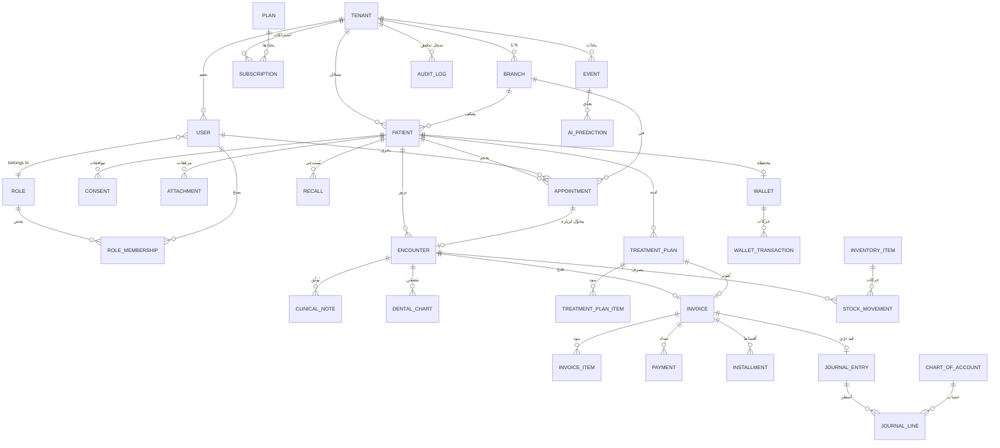
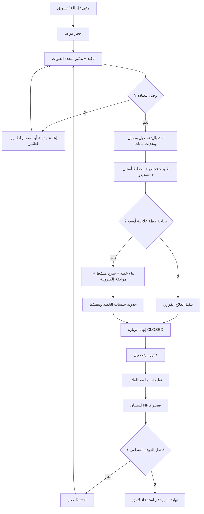
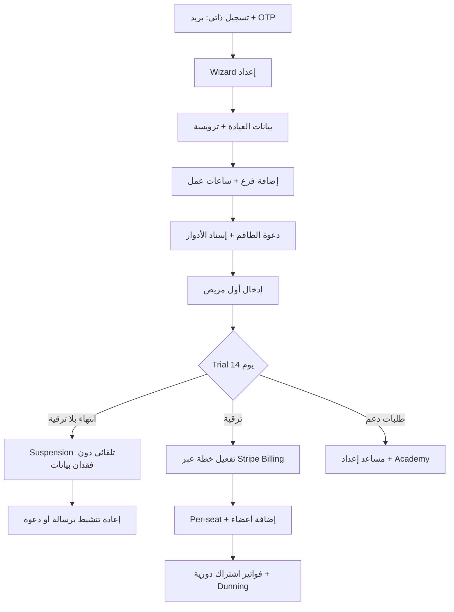
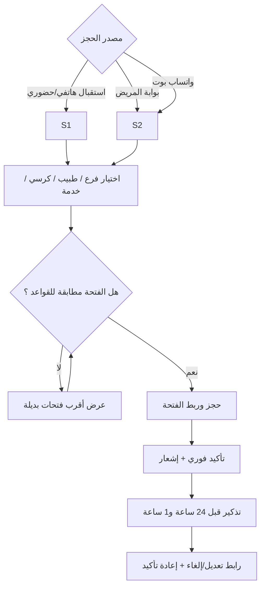
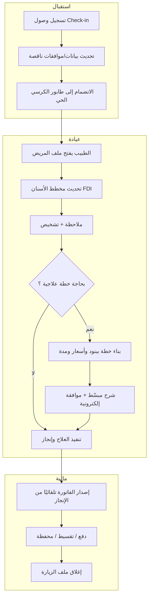
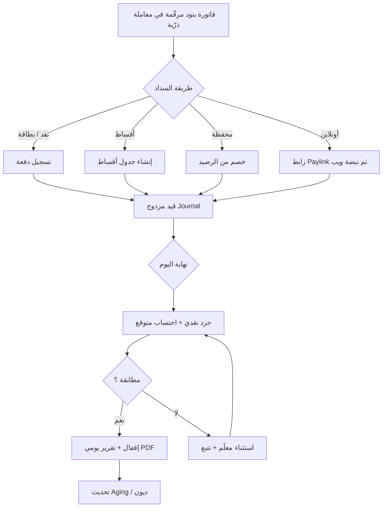
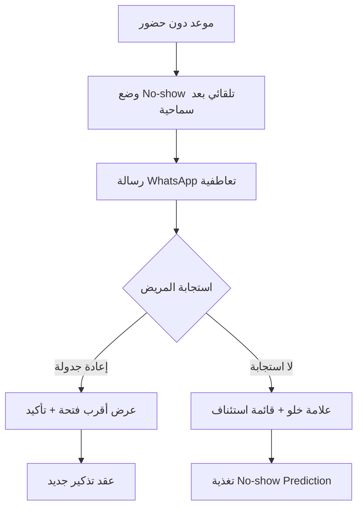
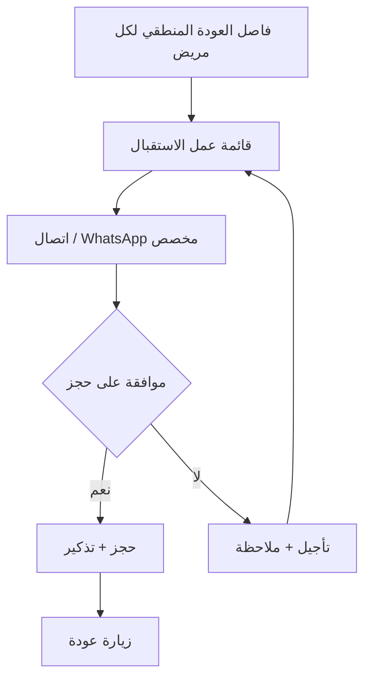

# الوثيقة المرجعية الموحدة — Dental OS

**الإصدار:** 4.1 — المدخل الموحّد + طبقة التنفيذ (Blueprint + Execution)
**آخر تحديث:** سبتمبر 2026
**أُضيف في 4.1 (قبل أي تطوير):** §25 خريطة قاعدة البيانات · §26 خطة MVP · §27 تدفّق المستخدم
**أصل الوثيقة:** دمج واكتمال ثلاث وثائق سابقة:
1. `Product Requirement Document.md` — PRD v2.0 (بنية MERN، مراحل 1–4 منجزة فعليًا في الكود).
2. `Product Requirement Document - Advanced SaaS.md` — رؤية v3.0 (الطموح: AI + شبكة + Fintech).
3. `Medplum-ValueMap-DentalOS.md` — خريطة التوافق مع Medplum/معايير FHIR (طبقة القيمة والامتثال).

**قاعدة:** هذه الوثيقة هي المرجع الوحيد المعتمد للمتابعة. أي ميزة جديدة تُكتب هنا قبل التطوير.

---

## جدول المحتويات

1. [نظرة عامة وأصل التوحيد](#1-أصل-التوحيد)
2. [الرؤية والملخص التنفيذي](#2-الرؤية)
3. [الحالة الراهنة (ما أُنجز حتى الآن)](#3-الحالة-الراهنة)
4. [القرارات الهندسية الجوهرية (ADR)](#4-القرارات-الهندسية)
5. [المعمارية الكلية](#5-المعمارية)
6. [سطوح المنتج](#6-سطوح-المنتج)
7. [المستخدمون والأدوار والصلاحيات](#7-المستخدمون-والأدوار)
8. [مزايا تطبيق العيادة](#8-تطبيق-العيادة)
9. [السجل السريري ومخطط الأسنان وخطط العلاج](#9-السجل-السريري)
10. [الفوترة والتحصيل والمالية](#10-الفوترة-والمالية)
11. [تجربة المريض والاحتفاظ](#11-تجربة-المريض)
12. [طبقة الذكاء الاصطناعي والأتمتة](#12-طبقة-الذكاء)
13. [منصة الـ SaaS](#13-منصة-saas)
14. [التكاملات والمعايير الصحية](#14-التكاملات-والمعايير)
15. [محلّل الفجوات الموحّد](#15-محلل-الفجوات)
16. [التحليلات والـ BI](#16-التحليلات)
17. [الأمان والامتثال](#17-الأمان-والامتثال)
18. [المتطلبات غير الوظيفية (NFR)](#18-المتطلبات-غير-الوظيفية)
19. [نموذج العمل](#19-نموذج-العمل)
20. [خارطة الطريق الموحّدة](#20-خارطة-الطريق)
21. [مؤشرات النجاح (KPIs)](#21-مؤشرات-النجاح)
22. [المخاطر والتخفيف](#22-المخاطر)
23. [العملية التطويرية والجودة](#23-العملية-التطويرية)
24. [جولة الفحص الحي (قبل البدء)](#24-جولة-الفحص-الحي)
25. [خريطة قاعدة البيانات](#25-خريطة-قاعدة-البيانات)
26. [خطة MVP](#26-خطة-mvp)
27. [تدفّق المستخدم](#27-تدفّق-المستخدم)

---

## 1. أصل التوحيد

| المصدر | ما نأخذه منه | ما نتجاوزه |
|---|---|---|
| PRD v2.0 (MERN) | الكود القائم فعليًا: EMR، الخطة المالية، المحاسبة، المخزون، SaaS Platform | تسميته "نهائية" — يُعامَل كأساس تشغيلي لا كوثيقة حاكمة |
| Vision PRD v3.0 | الرؤية: تجربة المريض، AI-Native، Fintech، الشبكة والتوسع، نموذج العمل | نزعة إعادة البناء من الصفر؛ تصاميم معمارية عامة لا تخصّ كودنا |
| Medplum-ValueMap | التوافق مع FHIR، الترميز السني (FDI/ISO)، تصنيف الجهد، "جولة الفحص الحي" | قرار افتراض Medplum كاستضافة أساسية (نرفضه — انظر ADR-1) |

**الخلاصة:** نحن نبني فوق كودنا الحالي (MERN، مراحل 1–4 منجزة ومُختبَرة)، نحو رؤية v3.0، مع طبقة توافق معايير مستوحاة من خريطة Medplum — دون إعادة كتابة.

---

## 2. الرؤية

**Dental OS = "Shopify + Expensify للعيادات"**: نظام تشغيل متكامل + ذكاء اصطناعي رأسي + اقتصاد شبكي، ليكون أول منصة صحة فم في المنطقة.

ثلاث طبقات في منتج واحد:

1. **نظام التشغيل التشغيلي (Core OS):** مرضى، EMR، حجوزات، فوترة، مخزون، محاسبة — **مكتمل في أساسه** (مراحل 1–4).
2. **طبقة الذكاء (Intelligence):** No-show prediction، Recall Engine، Revenue Forecast، Copilot نصي — **مبنية كخدمات مستقلة** فوق API.
3. **طبقة النمو (Network & Monetization):** بوابة المريض، الولاء والإحالة، Marketplace، شركاء — **خارطة الطريق القادمة**.

### مبادئ المنتج
- **Mobile-First للمريض، Desktop-First للتشغيل.**
- **AI-Native:** كل شاشة لها طبقة تساعد (بلا مزايا AI "معلقة").
- **Configurable everywhere:** إعدادات قابلة للتخصيص لكل عيادة/دور/فرع.
- **Open by default:** API + Webhooks + SDK من اليوم الأول.
- **Privacy-first & Compliance-by-design:** عزل المستأجر والتحديق جزء من المعمار منذ البداية (موجود فعلًا).

---

## 3. الحالة الراهنة

ما هو **مكتمل ومشغول** في الكود الحالي (`server/`, `dental os/`, `dashboard/`):

| الموديول | التفاصيل المنجزة |
|---|---|
| المصادقة | JWT ثنائي (Access 1h / Refresh 7d) في Cookies، bcrypt، CSRF، Rate Limit، 2FA (TOTP) إلزامي للمنصة |
| RBAC | 20 موديول × CRUD، 8 أدوار مدمجة، أدوار ديناميكية، `checkPermission` على الخادم، `tenantRouter` + `phiRestrict` |
| المرضى | ملف موحد + Patient ID متسلسل + PHI + عزل فرع/مستأجر + Patient Limit حسب الخطة |
| EMR | مخطط أسنان تفاعلي (فكين)، ملاحظات إكلينيكية، خطط علاج وبنود، روشتات، مرفقات، Timeline |
| الحجوزات | تقويم يوم/أسبوع/شهر، حجز بالطبيب/الكرسي، طابور Live عبر Socket.io، حالات زمنية، توافرية الطبيب |
| الفوترة | فوترة حسب الإنجاز، خصومات/ضرائب، طرق دفع، دفعات جزئية، استردادات، ترقيم آمن في Transactions، عمولات الأطباء، Aging |
| الأقساط والمحفظة | جداول أقساط، محفظة رصيد دائن/مدين، تحويلات، Cron تنبيهات للعلامة |
| المحاسبة | شجرة حسابات + Journal (قيد مزدوج)، إقفال يومي، مصروفات، مسحوبات ملاك، عزل محكم للطبيب |
| المخزون | مواد + Reorder Point + توريد/صرف/إهلاك + خصم تلقائي مرتبط بالإجراءات |
| المحادثة | DM + قنوات، Read Receipts، إشعارات صوتية |
| WhatsApp | whatsapp-web.js + بنية تبديل (Cloud API/Twilio قادمة) لتأكيد/تذكير المواعيد وتنبيهات الأقساط |
| SaaS Platform | مستأجرون (Tenants)، خطط/اشتراكات، Suspension Cron، Analytics، Audit Logs غير قابل للتغيير، Backups مشفّر، Health/Perf، Feature Flags، Error Logs، Quarantine، Impersonation، 2FA |

**الاختبارات:** Vitest (وحدة/عقود/أمان)، اختبارات Tenant Isolation في CI، load-test، security-scan.

---

## 4. القرارات الهندسية الجوهرية

> **الغرض:** حسم الخلاف بين الوثائق الثلاث قبل أي كود جديد.

### ADR-1: أساس البناء = الكود الحالي (MERN)، لا إعادة كتابة على Medplum
- السبب: مراحل 1–4 مبنية ومختبَرة ومستقرة (مصادقة، عزل، معالجة مالية ACID). إعادة الكتابة تُهدر أصلًا جاهزًا بلا مبرر تشغيلي.
- كل إشارات "نبني على Medplum" تُترجم إلى: **"نجعل بياناتنا متوافقة مع FHIR للتصدير/مزودات/امتثال"**.
- Medplum نفسها تُحتفظ بها كمرجع اختياري لاحقًا (خادم FHIR للتحقق من التصدير أو طريق هجرة مستقبلي)، **ليست وقت تشغيل**.

### ADR-2: توافق FHIR = طبقة تعيين + تصدير، لا حوكمة بيانات
- نموذجنا (Mongo) أصل الحقيقة. خريطة تعيين (Mapping) رسمية بين مجموعاتنا وموارد FHIR (انظر القسم 14) تُكتب مرة وتُستخدم للتصدير/الاستيراد.

### ADR-3: الفاتورة = سلسلة واحدة ذرية (لا تتجزأ)
- فاتورة → ترقيم آمن + قيد Journal + دفع/محفظة/أقساط + خصم مخزون + احتساب عمولة، كلها في Transaction واحدة. (مطبق؛ يُمدد لأي حركة جديدة).

### ADR-4: طبقة AI = خدمات مستقلة تستهلك события وAPI
- لا تُزرع نماذج داخل نواة البيانات. تُبنى خدمة `events pipeline` (من Mongo/Socket) أولًا ثم خدمات التنبؤ فوقها.

### ADR-5: فتح بوابات/خدمات مالية = شركاء خارجيون، والمنطق الداخلي محايد
- المحفظة والأقساط والعمولات داخلية (جاهزة). بوابات الدفع وBNPL تُربط بواجهة مجردة (PaymentGateway Interface) حتى يمكن تبديل شريك دون لمس الفوترة.

### ADR-6: التعريب/RTL = طبقة i18n خاصة من اليوم الأول (موجودة؛ تُعمَّم لكل سطح)
- عربي (افتراضي RTL) + إنجليزي، ثيمات لكل عيادة، عملات/تواريخ عبر Intl.

### ADR-7: الأتمتة = قواعد/مهام قابلة للبرمجة فوق طبقة الأحداث
- Emit أحداث (موعد أُكمل، قسط تأخر، مخزون منخفض...) → اشتراك → فعل (رسالة، مهمة، طلب شراء). محرر No-Code يُبنى لاحقًا فوق نفس الطبقة.

---

## 5. المعمارية

```
┌──────────────────┬──────────────────┬──────────────────┐
│  Patient Web/PWA │  Staff Web       │  SaaS Console    │
│  (جديد H1)       │  dental os/ ✅    │  dashboard/ ✅   │
├──────────────────┴──────────────────┴──────────────────┤
│               API Gateway (Express 5 + Socket.io)        │
│  auth • csrf • 2fa • rbac • tenantRouter • phiRestrict   │
│  rateLimit • security • audit • requestId • webhooks     │
├──────────────────┬─────────────────────────────────────┤
│  Mongo (ACID TX) │  Redis (جلسات/قوائم/Rate Limit)      │
│  Mongoose 9      │  + Event Bus (أحداث الطبقة الذكية)    │
├──────────────────┴─────────────────────────────────────┤
│  AI Service Layer (خدمات مستقلة — جديدة):               │
│  No-show / Recall / Revenue Forecast / Estimator /      │
│  Copilot RAG (API الخاص بها يستهلك Events + Data)       │
└────────────────────────────────────────────────────────┘
```

- **Monolithic Modular** في `server/modules/*` مع مسار فصل خدمات لاحقًا.
- **Multi-Tenancy عملي:** `tenantId`+`branchId` في كل مستند، يُفرض عبر Middleware لا نية المطور.
- **Real-time:** Socket.io للطابور والمحادثة والتقويم؛ وستُستخدم نفس القناة كـ **مصدر أحداث لطبقة AI**.

---

## 6. سطوح المنتج

| السطح | الحالة | مسؤولياته |
|---|---|---|
| تطبيق العيادة (Staff Web) | ✅ منجز | تشغيل يومي: EMR، جدول، فوترة، محاسبة، مخزون، محادثة |
| لوحة المنصة (SaaS Admin) | ✅ منجز | مستأجرون، خطط، Analytics، Audit، Backups، Health، Flags |
| بوابة المريض (Web/PWA) | ❌ جديد (H1) | حجز ذاتي، دفع/Paylink، موافقة إلكترونية، متابعة، دردشة، استبيانات |
| لوحة الشركاء/الموزع | ❌ جديد (H3) | Reseller + عمولات + Quotes |
| AI Copilot & Analytics | ❌ جديد (H1–H3) | مساعد نصي + BI متقدم |

---

## 7. المستخدمون والأدوار والصلاحيات

- **المصفوفة الحالية:** 20 موديول × CRUD (منقول كما هو من v2، وهو الأصل الوحيد للصلاحيات).
- **الأدوار المدمجة (8):** receptionist / doctor / assistant / accountant / inventory_manager / clinic_manager / platform_admin / super_admin.
- **أدوار ديناميكية:** إنشاء أدوار مخصصة عبر مصفوفة (موديول × CRUD) مع تحقق منفّذ على الخادم.
- **ما يُضاف في v4 (من الرؤية):**
  - 🟡 صلاحيات مؤقتة (Time-boxed): "صلاحية حتى نهاية ورديتي" — تُطبق كحقل `expiresAt` على عضوية/دور لحظي.
  - 🟡 تفويض (Delegation): نائب طبيب بصلاحية مساحية ومُقيَّدة زمنيًا مع سجل من.
  - 🟡 خطط صلاحيات حسب الاشتراك (`planModules`) — موجودة؛ تُربط بواجهة الترقية الذاتية (H1).
  - ✅ Impersonation + 2FA للمنصة — موجودة.

---

## 8. تطبيق العيادة

(موجود ومفصّل في v2؛ يُحتفظ به كمرجع تفصيلي. هنا الموجز + الإضافات)

| الموديول | الحالة | اللاحق في v4 |
|---|---|---|
| المرضى + بحث + عزل أفرع | ✅ | — |
| EMR + مخطط الأسنان | ✅ | ترميز FDI/ISO + Export معياري (انظر §14) |
| الحجوزات + الطابور Live | ✅ | اقتراح أوقات ذكي (AI) ومواعيد هجينة (عيادة/أونلاين) |
| الفوترة + عمولات + Aging | ✅ | Paylink + بوابات خارجية (§10) |
| الأقساط + المحفظة | ✅ | كوبونات/خصومات + BNPL (§10) |
| المحاسبة + إغلاق يومي | ✅ | تقارير ضريبية قابلة للتصدير (§10) |
| المخزون + خصم آلي | ✅ | FIFO/Batch/Serial + بوابة موردين (§14) |
| المحادثة | ✅ | — |
| WhatsApp | ✅ | Cloud API/Twilio كمصدر أساسي (web.js كخيار محلي) |

**قاعدة الإغلاق:** كل حركة مالية/مخزنية تُضاف في v4 تلتزم بـ Critical Flow (Transaction). التدفقات الحرجة المعتمدة: **فاتورة، تحصيل قسط، عزل مستأجر، إقفال يومي**.

---

## 9. السجل السريري ومخطط الأسنان وخطط العلاج

### 9.1 مخطط الأسنان
- 🟡 **ترميز موحّد للسن والوجه:** اعتماد **FDI (ISO 3950)** كأساس + دعم Palmer للعرض. يُخزَّن `toothNumber` + `surface(s)` في مخططات الأسنان والملاحظات وجدول العلاج.
- 🟡 **اقتراح إجراء حسب تشخيص السن:** عند تحديد "تسوس" يُقترح بند خطة/سعر من Fee Schedule — قواعد أولًا ثم AI.

### 9.2 خطط العلاج والموافقة
- ✅ خطة ببنود (علاج/مدة/سعر/أخصائي).
- ❌ **عرض مبسّط للمريض (Friendly View):** بالصور والثيم، وموافقة إلكترونية من هاتفه (H1).
- 🟡 تحويل الخطة بنقرة → فاتورة/أقساط/مطالبة تأمين (H2).

### 9.3 التوثيق
- ✅ ملاحظات (نصي/منظم)، روشتات، مرفقات، Timeline، صور قبل/بعد.
- 🟡 **توقيع إلكتروني:** خدمة توقيع محلية E-signature لموافقات H1.
- ❌ تعرّف الوجه (اختياري، بعد H3).

---

## 10. الفوترة والتحصيل والمالية

| البند | الحالة | الخطة |
|---|---|---|
| فوترة بنود + تسلسل آمن + دفعات جزئية + استرداد | ✅ | — |
| قيد مزدوج + إقفال يومي + عمولات | ✅ | — |
| أقساط + محفظة + تنبيهات تأخر | ✅ | كوبونات/خصومات (H2) |
| **بوابات دفع معرّبة** (Stripe/Moyasar/Shift4Pay/PayTabs + محافظ STC Pay.../Fawry) | ❌ | H1 عبر `PaymentGateway Interface` (ADR-5) |
| **Paylink عبر WhatsApp** | ❌ | H1: Bot يولّد رابط دفع داخل فاتورة/رسالة |
| **تسوية مصرفية تلقائية** (CSV/Bank) | ❌ | H2: ربط كشف بنكي + تطابق آلي مع الدفعات |
| **تقارير ضريبية (VAT/Fees)** قابلة للتصدير | 🟡 | H1: PDF/Excel |
| **BNPL** (Tamara/Tabby/valU/eFinance) | ❌ | H2 بعقد تمويل + Bots |
| Aging / RCM من خدمة إلى تحصيل | ✅ (أساس) | 🟡 شاشات RCM كاملة H2 |

---

## 11. تجربة المريض والاحتفاظ

### 11.1 بوابة المريض ❌ (H1 — Web/PWA أولًا، ثم Native)
- معرفة المريض: **الرقم الوطني/البريد + OTP** لربط ملفه بآمن.
- حجز ذاتي: فرع/طبيب/خدمة + أوقات مفتوحة + نطاق سعر + تأكيد فوري (أو بموافقة).
- مواعيدي: عرض/تأجيل/إلغاء + تذكير متعدد القنوات (WhatsApp/SMS/Push/Email).
- خطة العلاج: عرض مبسط + موافقة إلكترونية + أقساط مقترحة.
- الدفع: محفظة/بنك/Paylink + سجل فواتير بالضرائب.
- ما بعد العلاج (Post-Op): تعليمات + تذكير بمتابعة.
- NPS/استبيانات: قصيرة بعد الزيارة تغذي Recall والإحالة.
- قناة تواصل: دردشة مع العيادة + استفسارات/استرداد.

### 11.2 محرك الاحتفاظ 🟡 (H2)
- Recall 360°: لكل مريض "موعد عودة منطقي" → قائمة عمل استقبال + اتصال.
- Reactivation: مرضى غائبون ≥ 90 يومًا + رسائل ذكية وحملات.
- Loyalty & Referral: نقاط/رصيد + بطاقة اشتراك سنوي + مكافأة "صديق".
- Campaign Manager: إرسال/قياس A/B عبر القنوات في لوحة واحدة.

---

## 12. طبقة الذكاء والأتمتة

### 12.1 البنية (ADR-4)
```
Mongo + Socket Events → Event Bus Queue → Feature Store (مجمّع لكل مستأجر/مريض)
                                        → Prediction Services → Action Engine (Bots/Cron)
```
- ✅ **Event Bus (في الذاكرة)** يلتقط حدث (موعد منشأ/مكتمل/ملغي/No-show، مريض جديد، موافقة موقّعة، دفعة/فاتورة، قسط متأخر، مخزون منخفض) → **Event Log** (30 يوم) + يغذي محرك الأتمتة (`services/eventBus.js`).

### 12.2 خدمات الذكاء (بأولوية)
| الخدمة | الأولوية | الملاحظات |
|---|---|---|
| No-show Prediction | 🔵 H1 | نموذج خفيف (خصائص الماضي + التاريخ) → علامة عالي/متوسط/منخفض |
| Revenue Forecast & Cash Flow | 🟠 H2 | من الجدول والعمولات والمؤجلات |
| Recall Engine | 🟠 H2 | موعد العودة المنطقي + قائمة جاهزة |
| Treatment Estimator | 🟠 H2 | من مخطط الأسنان + Fee Schedule + التاريخ |
| Staff Copilot (RAG نصي) | 🟠 H2-H3 | API + Retriever فوق بيانات المستأجر فقط + صلاحيات |
| Action Execution بنص طبيعي | 🟠 H3 | عبر Bots (تُنفَّذ فقط بإذن وعن طريق أذونات المستخدم) |
| Voice-to-Note (عربي) | 🔴 H3 | عبر STT خارجي |
| X-Ray Assistant (Beta) | 🔴 H3 | Human-in-the-loop إلزامي (G3) |

### 12.3 الأتمتة
- ✅ Cron Jobs قائمة (أقساط، تعليق اشتراكات، نسخ احتياطي).
- ✅ **قواعد/اشتراكات أحداث:** محرك `Trigger → Condition → Action` داخلي (Subscription على أحداث النظام) في `services/automationEngine.js` — نطاق فرع، تهدئة (cooldown)، Dry-run/اختبار `/test`، سجل تشغيل `automationRuns`، أذونات `automations`.
- 🟡 **محرر No-Code** فوق المحرك (H2): المحرك + REST جاهزان؛ المحرر البصري مؤجّل.
- ✅ قوالب جاهزة (تُثبَّت معطّلة افتراضياً لتجنّب تكرار كرونات WhatsApp): مكافحة No-show، Survey بعد زيارة، Reorder ذكي عند انخفاض المخزون، Recall — في `constants/automations.js`.

---

## 13. منصة الـ SaaS

| البند | الحالة | اللاحق |
|---|---|---|
| مستأجرون + خطط + Suspension | ✅ | **Stripe Billing (اشتراكات فعلية)** H1: Trial 14 يوم → خطة → دفع تلقائي → Dunning |
| Quotas/حدود | ✅ | ربط تجاوز الحدود بالتنبيهات + الـ billing (H1) |
| Onboarding ذاتي | ❌ | معالج تهيئة (Wizard) H1: بيانات العيادة → إعداد فرع → دعوة طاقم → أول مريض |
| Tenant Cockpit | ✅ (أساس) | 🟡 إشعارات تجاوز + استخدام لكل موديول |
| White-label / Domain مخصص | 🟡 | H3: Brand kit (شعار/ألوان/لغة)} + custom domain |
| Marketplace + Partner Console | ❌ | H3 |
| Benchmarks مجهولة بين العيادات | ❌ | H3 (بعد Data Lake) |

---

## 14. التكاملات والمعايير الصحية

### 14.1 **خريطة تعيين FHIR الموحّدة** (من Medplum-ValueMap، مُعاد صياغتها على كودنا)

| مجموعتنا (Mongo) | مكافئ FHIR | الحالة |
|---|---|---|
| `tenants` | `Group` / (Project) | ✅ داخلي؛ لا يُصدَّر |
| `users`/`roles` | `Practitioner` + `PractitionerRole` | 🟡 حقل `practitionerId` اختياري |
| `patients` | `Patient` + `Identifier` (رقم وطني) | ✅ الخريطة مباشرة |
| `appointments` | `Schedule` + `Slot` + `Appointment` | ✅ |
| `dentalcharts`/`clinicalnotes` | `Observation` (tooth+surface) + `Condition` | 🟡 ترميز FDI/ISO |
| `treatmentplans` | `CarePlan` + `ServiceRequest` | 🟡 |
| `prescriptions` | `MedicationRequest` | ✅ |
| `attachments` | `Media`/`DocumentReference` | 🟡 |
| `invoices`/`installments` | `ChargeItem`/`Invoice` | 🟡 |
| `insurance claims` (جديد) | `Claim` + `ClaimResponse` | ❌ H2 (بنية FHIR رسمية) |
| `inventory` | `Medication` + `SupplyRequest`/`SupplyDelivery` | 🟡 |

### 14.2 التصدير/الاستيراد
- ❌ **FHIR Export Endpoint** (H1): `/fhircast` أو `/api/fhir/export` يولّد bundles (Patient, Encounter, Observation, CarePlan, Invoice) للعيادة/المريض → doc.
- خاصية "استيراد FHIR" تُفعَّل عند الشريك/المنصات الحكومية (H2).

### 14.3 تكاملات تشغيلية
| التكامل | الحالة |
|---|---|
| WhatsApp (3 منافذ: Web/Cloud/Twilio) | 🟡 استكمال المنفذين الأخيرين H1 |
| بوابات دفع عربية + Paylink | ❌ H1 |
| تقويمات Google/Microsoft للأطباء | ❌ H2 |
| Zapier/Make Webhooks | ❌ H2 (عبر حدث النظام المشترك) |
| محاسبة خارجية (QuickBooks/Xero/Zoho) | ❌ H2 |
| Portal موردين للمخزون | ❌ H2 |
| أشعة/DICOM | ❌ H3 (Orthanc/بوابة DICOM خارجية؛ `ImagingStudy` FHIR للتعيين) |
| شبكات تأمين إلكترونية محلية | ❌ H3 (حسب شريك) |

---

## 15. محلل الفجوات الموحّد

> مفتاح التصنيف: ✅ مكتمل في الكود / 🟡 تحسين على الكود القائم / ❌ بناء جديد
> الجهد: 🔵 أيام / 🟠 أسبوع–2 / 🔴 شهر+

| الميزة (المصدر) | الحالة | الجهد | ملاحظة البناء |
|---|---|---|---|
| الهوية + RBAC + 2FA + عزل المستأجر | ✅ | — | — |
| EMR + مخطط أسنان + خطط علاج + روشتات | ✅ | — | — |
| حجوزات + طابور + WhatsApp | ✅ | — | استكمال Cloud/Twilio |
| فوترة + أقساط + محفظة + محاسبة + مخزون | ✅ | — | — |
| ترميز FDI/ISO + تعريفات سينية موحّدة (v3/Medplum) | 🟡 | 🟠 | §9.1 |
| FHIR Export Endpoint (Medplum) | ❌ | 🟠 | §14.2 |
| بوابة المريض Web/PWA (v3) | ❌ | 🔴 | §11.1 |
| Paylink عبر WhatsApp (v3) | ❌ | 🟠 | §10 |
| بوابات دفع عربية (v3) | ❌ | 🔴 | §10 عبر واجهة مجردة |
| تقارير ضريبية قابلة للتصدير (v2/v3) | 🟡 | 🟠 | §10 |
| Stripe Billing + Onboarding Wizard (v3) | ❌ | 🔴 | §13 |
| No-show Prediction (v3/Medplum) | ❌ | 🟠 | §12 |
| Recall Engine (v3) | ❌ | 🟠 | §12 |
| توقيع إلكتروني + موافقة مريض (v3) | ✅ (Backend) | 🟠 Portfolio/عرض وموافقة | §9.2 |
| محرك أتمتة + قوالب (v3/Medplum) | ✅ (Backend) | 🟠 محرر No-Code بصري | §12.3 |
| اشتقاقات/بنبدات أحداث → Event Bus (Medplum) | ✅ | 🟠 موفّر أحداث خارجي/Webhook | §12.1 |
| تسوية مصرفية تلقائية (v3) | ❌ | 🔴 | H2 |
| تأمين Claims Workbench FHIR (v3/Medplum) | ❌ | 🔴 | H2 |
| BNPL (v3) | ❌ | 🔴 | H2 بعقد خارجي |
| Campaign Manager + Loyalty (v3) | ❌ | 🟠 | H2 |
| محرر No-Code (Medplum) | ❌ | 🔴 | H2 |
| تقارير BI + Report Builder (v3) | ❌ | 🔴 | H1 أساس / H2 كامل |
| Telehealth (v3) | ❌ | 🔴 | H3 |
| Copilot RAG + Voice-to-Note + X-Ray (v3) | ❌ | 🔴 | H2–H3 |
| White-label + Marketplace + Benchmarks (v3) | ❌ | 🔴 | H3 |

---

## 16. التحليلات والـ BI

- ✅ لوحات أساسية (مدير/طبيب/استقبال) + Analytics منصة.
- 🟡 **BI Suite (H1):** عدّادات (استغلال كرسي، إنتاج طبيب، إيراد بالفرع، Aging) → رسم (Recharts موجود).
- ❌ **Report Builder (H2):** Filters/Grouping → CSV/PDF/Excel + جدولة بريد.
- ❌ **P&L لكل فرع/مجموعة (H2):** من Encounter/ChargeItem والفروع.
- ❌ **Benchmarks مجهولة** (H3) عبر Data Lake بمعالجة إخفاء للهوية.

---

## 17. الأمان والامتثال

(كل ما في v2 §10 قائم فعليًا ويُحتفظ به كأساس إلزامي — موجز هنا)

| المجال | الحالة | اللاحق |
|---|---|---|
| المصادقة + JWT + CSRF + 2FA | ✅ | 🟡 MFA موسّع + SSO/SAML OIDC (H3 للعيادات الكبيرة) |
| عزل المستأجر (Tenant Router + PhiRestrict) | ✅ + اختبارات CI | استمرار |
| Rate Limit متعدد + IP Allowlist + Security Headers + Input Sanitization | ✅ | — |
| Audit Logs غير قابلة للتغيير + Impersonation مسجلة | ✅ | — |
| Backup مشفّر + RPO/RTO | ✅ | 🟡 تقليل RPO إلى ≤ 15 دقيقة (Aول + نسخ ساعة) H2 |
| GDPR/HIPAA readiness + SOC2 | 🟡 | H3 (دليل ضوابط + فحص خارجي) |
| Data Residency (MENA) | 🟡 | H3 |

---

## 18. المتطلبات غير الوظيفية

| البند | المعيار |
|---|---|
| الأداء | P95 قراءة ≤ 200ms، كتابة ≤ 400ms، P99 ≤ 1s (مراقب آليًا) |
| التوافر | ≥ 99.9% (طموح 99.95% بعد H2) |
| قابلية التوسع | عزل أفقي + Redis + فهارس؛ فصل خدمات ثقيلة لاحقًا |
| الاسترداد | RPO ≤ 24h اليوم (هدف 15m)، RTO ≤ 1h |
| التعريب | عربي RTL (افتراضي) + إنجليزي، عملات/تواريخ عبر Intl |
| التوثيق | Swagger حي + Webhooks docs + SDK (JS) |
| الوصول | WCAG 2.1 AA للبوابات |
| المرونة | Lazy Loading + splitting (موجود) |

---

## 19. نموذج العمل

| الطبقة | الأسلوب |
|---|---|
| اشتراكات | Starter / Professional / Enterprise + Per-Seat (مطبقة داخليًا؛ تُربط بـ Stripe Billing في H1) |
| Add-ons | AI Suite، WhatsApp Campaigns، Telehealth، 2FA إلزامي للخطط العالية |
| Marketplace | عمولة ترشيح لكل شريك |
| رسوم الدفع | نسبة صغيرة على دفعات Checkout عند تفعيل بوابة |
| المعادلة | MRR = (مشترون×متوسط خطة) + add-ons + Marketplace cut |
| الهدف | ARPA 250–800$/شهر، Churn ≤ 2%، استرجاع CAC ≤ 12 شهر |

---

## 20. خارطة الطريق الموحّدة

### المرحلة H1 — إتمام قاعدة SaaS وعرض القيمة (0–3 أشهر، 🔵/🟠)
1. 🔵 ترميز FDI/ISO في مخطط الأسنان + معرّفات سينية موحّدة.
2. 🟠 FHIR Export Endpoint (الموجود أولًا: Patient/Encounter/Observation/CarePlan/Invoice).
3. 🔴 بوابة المريض Web/PWA (حجز + دفع + Paylink + موافقة إلكترونية + متابعة).
4. 🟠 Paylink عبر WhatsApp + تقارير ضريبية PDF/Excel.
5. 🔴 Stripe Billing + Onboarding Wizard (Trial 14 يوم → خطة → Dunning).
6. 🔴 بوابات دفع عربية أولى (Moyasar/Stripe) عبر `PaymentGateway Interface`.
7. 🟠 No-show Prediction (v1) + Event Bus.
8. 🟠 محرك أتمتة أساسي + قوالب (تذكير، Survey بعد زيارة، Reorder).
9. 🟠 Report Builder v1 (CSV).

### المرحلة H2 — المالية والذكاء (3–6 أشهر، 🟠/🔴)
- Claims Workbench (بنية FHIR رسمية Claim/ClaimResponse) + تتبع/Rebill.
- تسوية مصرفية تلقائية + BNPL (عقد Tamara/valU).
- Recall Engine + Campaign Manager + Loyalty & Referral.
- Revenue Forecast + Treatment Estimator.
- محرر No-Code فوق الأحداث + تكاملات Zapier/تقاويم/محاسبة خارجية.
- P&L لكل فرع + Aging RCM متقدم.
- نسخ متكررة (RPO 15m) + استعادة دورية.

### المرحلة H3 — التوسع والتميز (6–12 أشهر، 🔴)
- Copilot نصي (RAG) + Voice-to-Note + X-Ray Assistant (Beta مع Human-in-the-loop).
- Telehealth (فيديو عبر مزوّد) + مواعيد هجينة.
- White-label + custom domain + Partner/Reseller Console.
- DICOM/PACS + تكامل مختبرات/أشعة.
- Data Lake + Benchmarks مجهولة.
- Multi-region + SOC2 + تطبيقات موبايل Native (مريض/طبيب).

---

## 21. مؤشرات النجاح

| المؤشر | الهدف |
|---|---|
| No-show | ↓ ≥ 30% |
| DSO | ↓ ≥ 25% |
| WAU% (عيادات نشطة أسبوعيًا) | ≥ 85% |
| Monthly Churn | ≤ 2% |
| LTV:CAC | ≥ 5:1 |
| NSAT للمريض | ≥ 4.6/5 |
| مطابقة الإقفال اليومي | 100% |
| استجابة API | ≤ 200ms عادية |
| اختراقات مصفوفة الصلاحيات في الاختبارات | 0 |
| ARR | $1.5M خلال 24 شهرًا بعد الإطلاق التجاري |

---

## 22. المخاطر والتخفيف

| المخاطرة | التخفيف |
|---|---|
| AI يعطي نتيجة سريرية خاطئة | Human-in-the-loop، نطاق استخدام محدد، Feedback مبكر، G3 |
| خلل عزل بين المستأجرين | Middleware مركزي + اختبارات Tenant Isolation في كل CI + Masking |
| انخفاض اعتماد الاشتراكات | Trial + Onboarding Wizard + Academy |
| تأخر بوابات محلية | شركاء مسبقون + Interface مجرّد + Fallback |
| حظر جلسة WhatsApp | 3 منافذ وتبديل فوري |
| تعقّد التصدير FHIR قرب المواعيد | طبقة تعيين مستقلة تُبنى من الورشة الأولى؛ مراجعة في "جولة الفحص الحي" |
| Churn بعد العناية بالمريض | إظهار القيمة > 30 يومًا + تقارير أداء الطبيب |

---

## 23. العملية التطويرية والجودة

- **Feature SDLC** من v2 (موثّق في PRD السابق §15) يُطبَّق حرفيًا: متطلب → تصميم → تطوير → أمان → UI → اختبار → توثيق → CI/Gates.
- **Gates:** G1 (M0/H1): لا تسليم بلا Audit + Backup + حد استجابة. G2: لا منتج مالي بلا Transactions + سباق. G3: لا AI سريري بلا Human-in-the-loop + موافقة.
- **Pre-merge:** `npm run check` + `npm test` + `npm run lint` في الواجهتين + CI الأخضر.
- **شق جديد:** تدفّق الأحداث (Event Bus) يُختبَر مع محولات (Event contracts) قبل أي خدمة AI.

---

## 24. جولة الفحص الحي (قبل بدء H1)

1. **اختبار صدق الترقيم والحصر في بيئة حقيقية:** متوسط حجم (المستندات/العمليات) لعيادة بسنتين من البيانات؛ ضبط الفهارس والتحليل P95.
2. **توثيق خريطة تعيين FHIR بمثال حقيقي** (مريض كامل: ملف + أسنان + خطة + فاتورة) وتأكيد إخراج Export نظيف.
3. **اختبار طبقة الأحداث:** كتابة 3 أحداث نموذجية (موعد أكمل/قسط تأخر/مخزون منخفض) والتحقق من قابلية الاشتراك.
4. **تقييم `PaymentGateway Interface`:** نمذجة (Stripe + Moyasar) نظريًا وتحقق من عدم تسريب منطق الفواتير.
5. **مراجعة خيار OTP للمريض:** القنوات المحلية (SMS/WhatsApp) وتكلفتها لكل رسالة.
6. **اتخاذ قراران مؤجلان:** MFA الواسع لعملاء Enterprise (H1 أم H3) وطريقة أول بوابة دفع (Moyasar أم Stripe أولًا).

---

## 25. خريطة قاعدة البيانات (Database Blueprint)

> **الحالة:** خريطة **مستهدفة v4** تُكتب قبل أي تطوير (وفق قاعدة الوثيقة: "أي ميزة جديدة تُكتب هنا قبل التطوير"). أي فرق مع الكود الحالي يُعالج عبر **ترحيل مخطط (Migration)** مُرقَّم، لا عبر هدم الوثيقة.

### 25.1 مبادئ التصميم

| المبدأ | التفصيل |
|---|---|
| التخزين | MongoDB + ACID Transactions للنواة المالية (وفق ADR-3) |
| النمذجة | **Aggregate-Oriented:** فاتورة تحمل بنودها، خطة تحمل بنودها — اتساق عبر معاملة واحدة لا شبكة علاقات عميقة |
| Multi-tenancy | `tenantId` على كل مستند تشغيلي + `branchId` ميدانيًا؛ يُفرض في **طبقة التساؤل (Middleware)** لا نية المطور، وبفهارس مركبة تبدأ بالمستأجر |
| فصل الثابت عن المتغير | `Context` للتكوين (فروع/حسابات/أدوار/خطط) مقابل `Transaction` للمستندات المُرَقَّمة (فاتورة/قيد/دفعة/تسلسل) |
| الترقيم الآمن | Counters قابلة للمعاملات **لكل مستأجر ولكل سلسلة** (مريض/فاتورة/قيد) — تُؤمَّن ضمن كتلة الإغلاق الذرية |
| الخصوصية | حقل `phi` داخل السكيما + تشفير عند التخزين للحقول الحساسة + منع إخراجها من الاستجابات |
| عدم التعديل المالي | كل سجل مالي **لا يُعدَّل؛ يُعكَس (Reversal)** بمسار تدقيق |
| الحذف | Soft Delete للملفات المرجعية (`isActive` / `deletedAt`)؛ الحذف الفعلي حصري لمنصة التشغيل |
| المصطلحات | تُوحَّد في هذه الخريطة (`tenantId`/`branchId`)؛ التنفيذ قد يستخدم اختصارات تاريخية بدلالة واحدة (راجع §25.6) |

### 25.2 اتفاقيات الحقول المشتركة

| الحقل | النوع | القاعدة |
|---|---|---|
| `tenantId` | ObjectId → `tenants` | إلزامي لكل مستند تشغيلي؛ أول عنصر في أي فهرس مركب |
| `branchId` | ObjectId → `branches` | إلزامي للمستندات الميدانية (مريض/زيارة/فاتورة/حجز/مخزون) |
| `status` | enum | حالة آلة الحالة لكل كيان (قوائم حالة مرجعية موحّدة أدناه) |
| `createdAt` / `updatedAt` | Date | تلقائية |
| `createdBy` / `updatedBy` | ObjectId → `users` | إسناد وتدقيق |
| معرّف تسلسلي | String | عبر Counter مؤمَّن: `PT-00001` (مريض)، `INV-2026-0001` (فاتورة)… |

### 25.3 مخطط العلاقات (ER Core)



### 25.4 سجل المجموعات حسب المجال

#### المجال 1: الهوية والحوكمة (Governance)

| المجموعة | الوظيفة والحدود | فهارس/علاقات حيوية |
|---|---|---|
| `tenants` | كيان العيادة/المجموعة: خطة، حالة (trial/active/suspended/cancelled/archived)، حدود، ترويس/برَندنج، مفتاح تشفير | 1:N `branches`/`users`/`subscriptions` — `slug` فريد |
| `branches` | فرع: ساعات عمل، استراحة، مدة الفتحة، مخزون منفصل | 1:N `patients`/`appointments` — `(tenantId, name)` فريد |
| `users` | موظف/طبيب: `isDoctor`، أوقات عمل الطبيب، ضبط مواعيد، نسبة عمولة، 2FA، تفضيلات | `(tenantId, email)` فريد، `(tenantId, username)` فريد جزئي |
| `roles` | دور مدمج (8) أو مخصص: مصفوفة module×CRUD + نطاقات (فرع/وقت محدود/تفويض) | 1:N `roleMemberships` |
| `roleMemberships` | عضوية الدور بدورة حياة: `expiresAt` للصلاحيات المؤقتة + مرجع التفويض `delegatedBy` | `(userId, roleId, expiresAt)` |
| `plans` | تعريفات الخطط (حدود + وحدات + تسعير) | 1:N `subscriptions` |
| `subscriptions` | اشتراك فعلي بمصدر فوترة (Stripe): trial/dunning/دورة | `(tenantId, status)` |
| `featureFlags` | تفعيل/إيقاف ميزة لكل مستأجر/مستوى/دور | اختياري `tenantId` |
| `auditLogs` | سجل غير قابل للتعديل: actor/action/resource/فرق+هاش/IP/وقت | `(tenantId, ts, resource)` |

#### المجال 2: المرضى والسجلات المرجعية

| المجموعة | الوظيفة والحدود | فهارس/علاقات حيوية |
|---|---|---|
| `patients` | ملف موحّد: معرّف تسلسلي، اسم كامل، رقم وطني، تواصل، سجل طبي، تأمين، حالة، `mergedInto` للدمج | `(tenantId, patientId)` فريد · `(tenantId, branchId, phone)` فريد · `(tenantId, nationalId)` فريد جزئي · فهرس نصي (اسم/هاتف) |
| `consents` | موافقات بسياق: نوع (علاج/تصوير/تخدير/مالية/عامة/تواصل إلكتروني)، إصدار، E-sign بتوقيع زمني + هاش HMAC تمبّر-يفيدنس، انتهاء؛ **تُجمَّد بعد التوقيع** (withdraw فقط يحفظ السجل) | `(patientId, type, version)` جزئي على النشط |
| `attachments` | مرفقات مشفّرة (صور/أشعة/مستندات/توقيعات) + `accessClass: phi` | `(patientId, kind, createdAt)` |
| `suppliers` | موردون للمخزون (دفتر مرجعي) | `(tenantId, name)` فريد |

#### المجال 3: السجل السريري (Clinical)

| المجموعة | الوظيفة والحدود | فهارس/علاقات حيوية |
|---|---|---|
| `encounters` | زيارة سريرية: آلة حالة (arrived → in-progress → completed / no-show)، شكوى رئيسية، إجمالي تسعير | N:1 `patient`/doctor؛ 1:1 `appointment` — `(tenantId, branchId, date, status)` |
| `dentalCharts` | مخطط أسنان لكل جلسة بترميز **FDI/ISO** (toothNumber + surface + حالة) | `(patientId, version)` |
| `clinicalNotes` | ملاحظة منظمة/نصية + مراجع أسنان + تشخيص | `(tenantId, patientId, createdAt)` |
| `diagnoses` | تشخيص/حالة (SNOMED/FDI) موجّه لاقتراح الإجراء (§9.1) | `(patientId)` |
| `treatmentPlans` | خطة ببنود + آلة حالة (draft → proposed → approved → active → done/cancelled) + مرجع موافقة | `(tenantId, patientId, status)` |
| `treatmentPlanItems` | بنود الخطة: سن/وجه/إجراء/كمية/سعر/خصم/طبيب منفّذ | `(planId)` |
| `prescriptions` | روشتة: بنود دواء + جرعة/مدة/تعليمات + حالة صرف | N:1 `patient`/`encounter` |

#### المجال 4: الجدولة والاستدعاء

| المجموعة | الوظيفة والحدود | فهارس/علاقات حيوية |
|---|---|---|
| `slots` | فتحات مولّدة (available/booked/blocked) من ساعات الفرع+الطبيب والاستراحات | `(branchId, doctorId, start)` |
| `appointments` | حجز من **أي مصدر** (استقبال/بوابة/واتساب): آلة حالة + تذكير + سبب إلغاء | `(tenantId, branchId, start, status)` · `(doctorId, start)` |
| `recalls` | موعد عودة منطقي (Recall 360°) + نتيجة الاتصال | `(tenantId, dueDate, status)` |

#### المجال 5: الفوترة والمالية

| المجموعة | الوظيفة والحدود | فهارس/علاقات حيوية |
|---|---|---|
| `invoices` | فاتورة بترقيم آمن + آلة حالة (draft/issued/partial/paid/void/refunded) + إغلاق تسوية | `(tenantId, no)` فريد · `(patientId, createdAt)` |
| `invoiceItems` | بنود الفاتورة: وصف/كمية/وحدة/خصم/ضريبة/مرجع إجراء | `(invoiceId)` |
| `payments` | دفعة (نقد/بطاقة/محفظة/أونلاين/Paylink/قسط) + **استرداد بنوع refund** + مرجع بوابة | `(invoiceId)` · `(gatewayRef)` فريد جزئي |
| `installments` | جدول أقساط + حالات كل قسط + ربط بالدفعات | `(invoiceId, dueDate)` |
| `wallets` | محفظة رصيد المريض | 1:1 `patientId` فريد |
| `walletTransactions` | حركات المحفظة (رصيد/تحويل/استخدام/استرداد) | `(walletId, createdAt)` |
| `commissions` | عمولة طبيب: الأساس، النسبة، الحالة (accrued/paid) | `(doctorId, period)` |
| `chartOfAccounts` | شجرة حسابات: رمز تسلسلي، نوع، حساب أب | `(tenantId, code)` فريد |
| `journalEntries` | قيد مزدوج + مصدر مرجعي (invoice/payment/dayClose/expense) + انعكاس | `(tenantId, refType, refId)` |
| `journalLines` | أسطر القيد (حساب / مدين / دائن) | `(entryId)` |
| `expenses` | مصروف + حساب + مستند | `(tenantId, branchId, date)` |
| `ownerDrawings` | مسحوبات الملاك | `(tenantId, date)` |
| `dayCloses` | إقفال يومي: متوقع/فِعلي/فرق + قيد الإقفال | `(tenantId, branchId, date)` فريد |

#### المجال 6: المخزون

| المجموعة | الوظيفة والحدود | فهارس/علاقات حيوية |
|---|---|---|
| `inventoryItems` | صنف: SKU، فئة، وحدة، تكلفة/سعر، نقطة إعادة، مخزون، دفعة/صلاحية (FIFO/Batch) | `(tenantId, sku)` فريد |
| `stockMovements` | حركة (توريد/صرف/إهلاك/تحويل) بمصدر (زيارة/أمر شراء) | `(itemId, createdAt)` |
| `purchaseOrders` | أمر شراء + استلام + تسوية مورد | `(tenantId, status)` |

#### المجال 7: التواصل والاحتفاظ (H2–H3)

| المجموعة | الوظيفة والحدود | ملاحظات |
|---|---|---|
| `channels` / `messages` | قنوات DM + رسائل + Read Receipts | موجود في الأساس؛ يُفسَح لنوافذ القنوات |
| `notifications` | إشعارات + قوالب (WhatsApp/SMS/Push/Email) + سجل إرسال لكل مستلم | قوالب قابلة للترجمة |
| `campaigns` | حملات: segment + قناة + A/B | H2 |
| `loyaltyAccounts` | نقاط/رصيد ولاء + اشتراك سنوي | H2 |
| `referrals` | إحالات "صديق يقدّم صديقاً" | H2 |

#### المجال 8: المنصة والأحداث والذكاء

| المجموعة | الوظيفة والحدود | ملاحظات |
|---|---|---|
| `integrations` | إعدادات تكامل (WhatsApp Cloud، بوابات دفع، تقاويم) + Webhooks | عبر واجهة مجرّدة (ADR-5) |
| `events` | **Event Log** (موعد أُكمل/قسط تأخر/فاتورة/مخزون منخفض) يغذّي Event Bus | `(tenantId, type, createdAt)` — **مُنفَّذ** (TTL 30 يوم، واجهة عقود الأحداث §12.1) |
| `aiPredictions` | مخرجات النماذج + درجة ثقة + قرار إنساني | Human-in-the-loop إلزامي (G3) |
| `aiFeedback` | ملاحظات المستخدم على التنبؤ/الاقتراح | يغذّي التحسين |
| `backups` / `errorLogs` | سجلات نسخ واسترداد + أخطاء/Quarantine | موجود؛ يُوسَّع (RPO 15m) |

### 25.5 توافق FHIR

الخريطة الكاملة في §14.1. القاعدة هنا: **كل مجموعة بيانات قابلة للتصدير عبر "خريطة تعيين" واحدة لا ازدواجية فيها** — مثل `encounters → Encounter`، `dentalCharts → Observation(tooth+surface)`، `invoices → Invoice/ChargeItem`، `aiPredictions → RiskAssessment` (جديد خارج FHIR الأساسي).

### 25.6 حوكمة التغيير على المخطط

- أي **مجموعة/حقل جديد** يُسجَّل هنا (بقرار ADR) **قبل** الإنشاء في الكود.
- Migrations مُرقَّمة (versioned) مع اختبار تراجع + توقيع في "جولة الفحص الحي" (§24).
- اتفاقية الفهرسة المركزية تمنع استعلامات عابرة بين المستأجرين، وتُراجع في اختبارات العزل (CI).

---

## 26. خطة MVP (Minimum Viable Product)

### 26.1 فرضية النجاح "الحلقة الواحدة"

> **نجاح MVP = عيادة واحدة سجّلت ذاتيًا، أدارت دورة مريض كاملة إلكترونيًا خلال 30 يومًا دون تدخل منصة**: تسجيل ← حجز ← زيارة ← تشخيص/علاج ← فاتورة ← تحصيل ← تقارير/تذكير.
>
> **قاعدة التحكيم:** أي ميزة تُسأل: *"هل تبني أو تكسر هذه الحلقة؟"* — إن لم تكن طرفًا فيها أو حارسةً لها، هي خارج MVP.

### 26.2 نطاق داخل / خارج

| داخل MVP (Must / Should) | خارج MVP (Later) |
|---|---|
| Onboarding ذاتي + Trial 14 يوم + ترقية إلى اشتراك (Stripe Billing أساسي) | BNPL (عقد شريك) |
| المرضى: ملف + بحث + رقم وطني + دمج مكررات + حدود الخطة | Claims تأمين (FHIR كامل) |
| الحجز: تقويم + توافر أطباء + طابور حي + إعادة جدولة | بوابات دفع عربية متعددة (يكفي **Paylink** + محفظة داخلية في v0) |
| الزيارة السريرية: مخطط أسنان FDI + ملاحظات + خطة علاج + موافقة + روشتة | AI No-Show كامل (يُبنى فقط **Event Bus + هيكل أولي**) |
| الفوترة والتحصيل: ذرّية + دفعات جزئية + أقساط + استرداد + محفظة + عمولات | Recall/Campaign/Loyalty كامل |
| المحاسبة: قيد مزدوج + إقفال يومي + مصروفات + مسحوبات | محرر No-Code / أتمتة معقدة |
| المخزون الأساسي: صنف + حركة + تنبيه إعادة طلب | White-label / Domain / Marketplace |
| بوابة المريض **v0**: مواعيدي + عرض الخطة/موافقة + Paylink + استبيان ما بعد زيارة | Telehealth / Voice-to-Note / X-Ray |
| WhatsApp (Cloud API): تأكيد/تذكير/تنبيه قسط | Report Builder كامل / BI عميق |
| SaaS أساس: اشتراك + حدود + Audit + Backup + Health + Flags + Onboarding Wizard | Benchmarks مجهولة / Data Lake |

### 26.3 المحاور (Epics) ومعايير القبول

| # | Epic | مخرجات قابلة للاستخدام | معيار القبول |
|---|---|---|---|
| E1 | Onboarding & Billing | تسجيل ذاتي → Wizard (بيانات العيادة → فرع → دعوة طاقم → أول مريض) → Trial → اشتراك Stripe → Suspension تلقائي | عيادة تجريبية تعمل دون رسائل دعم |
| E2 | المرضى | ملف/بحث/رقم وطني/دمج/حدود خطة | بحث < 200ms؛ Phone فريد لكل فرع؛ لا خرق حدود |
| E3 | الحجز والطابور | تقويم + توافر + طابور Live + WhatsApp تأكيد/تذكير + إعادة جدولة | معدل حضور مؤكَّد ≥ 90%؛ لا تعارض مزدوج |
| E4 | الزيارة السريرية | تسجيل وصول → مخطط أسنان FDI → ملاحظات → خطة/موافقة → روشتة | زمن فتح الملف < 1ث؛ FDI صالح في كل القيود |
| E5 | الفوترة والتحصيل | فاتورة ذرّية مرقّمة + دفعات/أقساط/استرداد/محفظة + عمولة | 100% تطابق ترقيم؛ رصيد دفعات = فواتير |
| E6 | المحاسبة اليومية | شجرة حسابات + قيد مزدوج + إقفال يومي + مصروفات | إقفال مطابق 100%؛ كل فاتورة لها قيد |
| E7 | المخزون الأساسي | صنف/حركة/تنبيه إعادة + صرف تلقائي من الإنجاز | صرف الإجراء يخصم المخزون في نفس المعاملة |
| E8 | بوابة المريض v0 | مواعيدي + عرض الخطة/موافقة + Paylink + تعليمات ما بعد + استبيان NPS | موافقة رقمية أسرع من الورقية |
| E9 | SaaS Platform | اشتراك/حدود/Audit غير قابل للتعديل/Backup مشفّر/Health | صفر خرق عزل؛ استعادة ≤ 1س |
| E10 | تقارير الأساس | لوحات مدير/استقبال + قائمة تحصيل (Aging) + تقرير إقفال PDF | أرقام الإقفال = أرقام القيد = أرقام الفواتير |

### 26.4 التوزيع الزمني (12 أسبوع / 6 سبرنتات × أسبوعين)

| السبرنت | الهدف | المخرجات الكبرى |
|---|---|---|
| S1 | **الحوكمة والأساس** | تسجيل ذاتي + Trial + Wizard أبوي + عزل مستأجر كامل + Audit/Backup + Stripe Billing أساسي |
| S2 | **المرضى والجدولة** | ملفات/بحث/دمج + تقويم + توافر + طابور حي + تذكير WhatsApp |
| S3 | **الزيارة السريرية** | مخطط أسنان FDI + ملاحظات + خطة علاج + موافقة + روشتة |
| S4 | **الفوترة والتحصيل** | فاتورة ذرّية + دفعات/أقساط/استرداد/محفظة + عمولات + Paylink محلي |
| S5 | **المحاسبة والتقارير** | قيد مزدوج + إقفال يومي + مصروفات + لوحات أساسية + مخزون أساس |
| S6 | **الهادي (Beta & Polish)** | بوابة المريض v0 + إصلاحات + استبيان + أداء P95 + فرشاة بـ 5–10 عيادات تجريبية |

**خط الأساس الفرعي (تحقق كل أسبوعين):** يكون المنتج **قابلاً للعرض الحي** في نهاية كل سبرنت، لا "قيد التطوير".

### 26.5 تحكيم النطاق أثناء التنفيذ

- أي طلب ميزة: هل تخدم **الحلقة الواحدة** أم حارسًا لها؟ — نعم تُدرج؛ وإن لا تُؤجَّل في backlog مرقَّم.
- أي ميزة **تعتمد على شريك خارجي** (بوابة/BNPL/Telehealth) تُؤجَّل ما لم يُوقَّع الشريك قبل بداية السبرنت.
- كل تدفّق جوهري يُعبَّر بمخطط في §27 **قبل** التطوير، ويُحدَّث بعد التغير.
- لا "تحسينات عرض" متفرقة؛ تُجمع في S6.

### 26.6 تعريف الانتهاء للسباق (DoD)

- اختبارات وحدات/عقود خضراء + اختبارات **عزل مستأجر** في كل PR.
- Gates: G1 (Audit + Backup + حد استجابة)، G2 (المال عبر Transactions)، G3 (لا AI بلا Human-in-the-loop).
- Swagger حي لكل نقطة جديدة + توثيق "تدفّق المستخدم" للعرض.
- فحص أمان (CSRF + Rate Limit + صلاحيات) على كل موديول مالي.
- لا P0/P1 معلَّقة عند نهاية السباق.

### 26.7 معايير الخروج التجاري لمرحلة الـ MVP (Exit)

| المؤشر | الهدف |
|---|---|
| عيادات تجريبية (Beta) | 5–10 امتلكت عيادتها فعليًا |
| استمرارية استخدام | ≥ 80% من التجريبيين نشطون بعد 30 يومًا |
| التحويل Trial → Paid | ≥ 30% خلال 45 يومًا |
| مطابقة الإقفال | 100% |
| اختراق عزل في الاختبارات | 0 |
| P95 استجابة | ≤ 200ms |

### 26.8 الشروط المسبقة للبدء

اكتمال "جولة الفحص الحي" (§24) بنود 1–4، وقرار البوابة الأولى (§24 بند 6)، وتوقيع الالتزام بالجدول الزمني أعلاه من الفريق.

---

## 27. تدفّق المستخدم (User Flows)

> **قاعدة:** كل تدفّق جوهري يُرسم هنا (Mermaid — يُعرض على GitHub/VS Code) **قبل** التطوير ويُحدَّث عند تغيير القرارات. الرسومات أعلاه مرجعية للتنفيذ والتصميم.

### 27.1 الرحلة الرئيسية — من الوعي إلى العودة (دورة حياة المريض)



| الخطوة | الفاعل | القرار/الاستثناء | ما يفعّله النظام |
|---|---|---|---|
| الحجز | مريض/استقبال | غير متاح → اقتراح بديل | توافر + قواعد الطبيب |
| الوصول | مريض | غياب → No-show وإعادة | تذكير + طابور Live |
| التشخيص | طبيب | حاجة خطة → موافقة إلكترونية | FDI + اقتراح إجراء |
| الدفع | أمين صندوق | جزئي/أقساط/محفظة | فاتورة ذرّية + قيد |
| المتابعة | استقبال | استجابة إيجابية → حجز عودة | Recall Engine |

### 27.2 Onboarding عيادة جديدة (Trial → Paid)



### 27.3 حجز موعد (استقبال نهائي / بوابة ذاتية / واتساب)



### 27.4 يوم الزيارة — الزيارة السريرية (Swimlanes)



### 27.5 الفوترة والتحصيل والإقفال اليومي



### 27.6 عدم الحضور وإعادة الجدولة (No-show)



### 27.7 حلقة الاستدعاء والمتابعة (Recall)



> **تحديث المخططات:** أي تعديل على قرارات المنطق (حالات، أوقات، عتبات) يُنعكس هنا أولًا ثم في الكود — الوثيقة مرجع التنفيذ الوحيد.

---

*هذه الوثيقة هي المرجع الوحيد المعتمد. قُدمت بدعم واكتمال من الوثائق الثلاث السابقة (التي أُزيلت من المستودع).*